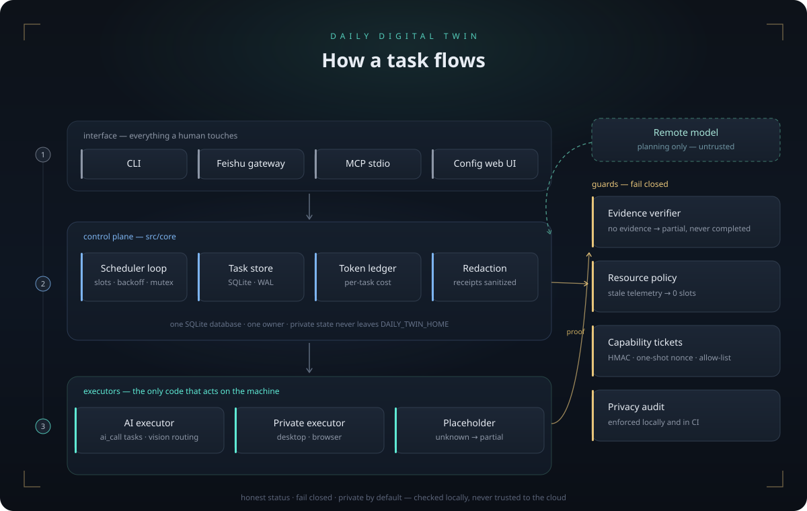

# Daily Digital Twin

**English** | [简体中文](README.zh-CN.md)

[](https://github.com/jing1312/daily-digital-twin/actions/workflows/ci.yml)


A privacy-first personal automation runtime for Windows. You submit tasks — from a phone, a terminal, or a web dashboard — a local scheduler executes them through controlled executors, and **nothing reports `completed` without observable evidence**. A task that cannot produce process, window, page, or file proof is reported as `partial`, never inflated.

Three principles run through the whole codebase:

| Principle | How it is enforced |
| --- | --- |
| Honest status | No file/process/window/page evidence → `partial`. Never a silent `completed`. |
| Fail closed | Broken config refuses to run; a failed executor refuses to load; missing telemetry means zero scheduling slots. |
| Private by default | Keys, database, outputs and logs live in a private `DAILY_TWIN_HOME` outside the repo, checked by a privacy audit in CI. |



## What it does

**Command layer** — `create`, `batch`, `morning`, `status`, `tree`, `history`, `show`, `cost`, `pause`/`resume`/`cancel`, `scheduler`, `daemon`/`serve`, `mcp`, `doctor`, `config`.

- `morning` takes a plain task list, sends it to the AI planner, and builds a parent–child task tree typed as `ai_call`, `desktop`, or `browser`. Parent tasks are containers only; the scheduler finalizes them once every sub-task reaches a terminal state.
- `batch` imports the same list without AI planning.
- `show` prints a task's full event stream, evidence, and token accounting.

**Executors**

- `ai_call` — runs through an OpenAI-compatible endpoint, with per-task token ledger entries (input, cached input, output, latency, local cost estimate). When the request references image files inside `DAILY_TWIN_HOME`, the executor routes to a vision-capable model (`executor.visionModel`) and carries them as multimodal input.
- `desktop` / `browser` — loaded from a private executor module in `DAILY_TWIN_HOME` (for example `executor/index.mjs`). The bundled private executor opens registered applications, sites, and URLs and reports process and window evidence. Without one, these task types honestly return `partial`.
- `unknown` — passes through untouched rather than being guessed at.

**Feishu control plane** (`serve`) — a WebSocket gateway that binds the first sender as the owner, accepts task and control messages (`status`, `pause`, `resume`, `cancel`, evidence requests), and answers with redacted receipts.

**Multica worker system** — complex tasks are decomposed by a planner into at most four isolated Codex workers. Workers hold HMAC-signed, one-shot capability tickets bound to a task id, an issue, a worker, an allow-list of sites/apps/directories, and an expiry. Workers can call high-level local MCP tools (`browser_open/fill/submit/wait/capture`, `app_launch`, `task_checkpoint`) — never a shell.

**Config web UI** (`npm run config`) — edit planner/executor endpoints, pull the model list from your provider and write it straight into the config, view open tasks, recent history and token spend, and start/stop the daemon, all on `127.0.0.1:18791`.

## Safety boundaries

This project can touch signed-in browser sessions and local applications, so it is deliberately conservative:

- The remote model is a planning component, not a trusted executor. Plans are reviewed locally before anything runs.
- The scheduler is disabled by default and must be enabled explicitly.
- CAPTCHA prompts, login dialogs, and human-judgement calls pause the task into `waiting_for_user` instead of improvising.
- Verification codes are passed only to the active page — never stored in receipts, database, logs, or cache.
- Desktop automation is foreground-exclusive; apps, files, and tabs are locked against conflicting tasks.
- Destructive or external actions (delete, overwrite, upload, pay, send, publish) require human confirmation.
- Secrets and personal paths never enter the repo — a privacy audit runs locally and in CI.

These controls reduce risk; they do not make unattended browser or desktop automation universally safe. Review the configuration and threat model before connecting real accounts.

## Resource policy

Heavy work scales with actual machine pressure, read from live telemetry:

| Condition | Slots |
| --- | ---:|
| Available memory ≥ 10 GB and CPU < 55% | up to 4 |
| Available memory 6–10 GB | 2 |
| Available memory 4–6 GB | 1 |
| < 4 GB, low disk, or stale telemetry | 0 |
| On battery | ≤ 1 |

Missing or outdated telemetry is not an edge case — it disables scheduling entirely.

## Task lifecycle


## Quick start

Requirements: Windows 11 (deployment target), Node.js ≥ 24, PowerShell 7 for platform scripts. No `npm install` — the project has zero runtime and development dependencies.

```powershell
# 1. point DAILY_TWIN_HOME at a private directory outside the repo
.\platform\windows\Set-DailyTwinPaths.ps1 -PrivateHome 'D:\DailyTwin\home'
$env:DAILY_TWIN_HOME = 'D:\DailyTwin\home'

# 2. initialise and self-check
npm run runtime -- init
npm run runtime -- doctor

# 3. submit work
npm run runtime -- create 'Summarise today's calendar'
npm run runtime -- morning .\tasks.txt --enable   # plan + decompose + start scheduler
npm run runtime -- status
npm run runtime -- show 1

# 4. optionally register scheduled tasks (preview first)
.\platform\windows\Install-DailyTwinServices.ps1 -PrivateHome $env:DAILY_TWIN_HOME -WhatIf
.\platform\windows\Install-DailyTwinServices.ps1 -PrivateHome $env:DAILY_TWIN_HOME
```

To enable the AI planner and executor, set `planner` and `executor` endpoints in the private `config/runtime.json` — easiest through `npm run config`.

Read [`docs/RUNBOOK.md`](docs/RUNBOOK.md) before enabling routine execution.

## Verification

```bash
npm test              # 387 unit tests
npm run audit:privacy # secrets / private paths must not enter the repo
npm run smoke         # CLI smoke test
npm run check         # tests + audit + smoke
```

Windows additionally runs `npm run lint:ps` and `npm run selftest:ps` (PowerShell parsing, encoding, and platform self-tests). CI enforces all of this on Linux and Windows with Node 24.

## Documentation

- [`docs/ARCHITECTURE.md`](docs/ARCHITECTURE.md) — trust model, state, scheduling, verification, design trade-offs
- [`docs/RUNBOOK.md`](docs/RUNBOOK.md) — setup, operations, cutover and rollback
- [`docs/BROWSER-PROFILES.md`](docs/BROWSER-PROFILES.md) — browser routes and unattended-operation limits
- [`docs/BUGFIX-LOG.md`](docs/BUGFIX-LOG.md) — defects, fixes, and the tests that guard them

## Roadmap

- Real browser executor: managed Playwright sessions behind the private executor interface.
- Crash self-healing for long-running daemons via Windows scheduled tasks.
- Per-capability model selection (cheap models for classification, stronger models for planning).
- Finishing the Feishu control-plane rollout (app credentials, worker binding) for phone-first usage.

## Licence

MIT. See [`LICENSE`](LICENSE).
